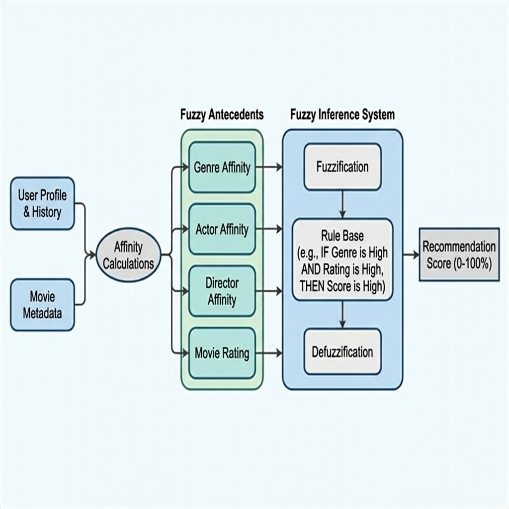

# Descrição do Modelo de Recomendação

Esta seção apresenta detalhadamente o funcionamento do modelo de recomendação proposto, descrevendo conceitualmente seu fluxo de processamento, a metodologia de construção do perfil do usuário, o formalismo matemático para cálculo das afinidades, a justificativa das funções de pertinência fuzzy e o processo de inferência lógica.

---

## 1. Funcionamento Geral do Modelo

O modelo de recomendação proposto fundamenta-se em um sistema híbrido de filtragem baseada em conteúdo e inteligência computacional por lógica fuzzy. O fluxo de processamento conceitual é estruturado em três macroetapas sequenciais, conforme ilustrado no diagrama abaixo:



1. **Entrada de Dados e Perfilamento:** O sistema coleta dados brutos compostos pelos metadados do filme sob análise e pelo perfil do usuário (explicitado por preferências declaradas e implicitado por seu histórico de consumo).
2. **Cálculo de Afinidades (Normalização de Antecedentes):** O modelo processa os históricos de engajamento do usuário e os cruza com as características do filme, extraindo métricas de interesse ponderadas (afinidades) em múltiplas dimensões, que são combinadas com o perfil de preferências para formar as variáveis antecedentes da lógica.
3. **Controlador Fuzzy (Inferência e Saída):** As variáveis numéricas de entrada passam pelo processo de fuzzificação, avaliação das regras de associação lógica e agregação das conclusões. Por fim, o conjunto resultante é defuzzificado, gerando o percentual final de recomendação (grau de adequação do filme ao usuário).

---

## 2. Construção do Perfil do Usuário

A caracterização do comportamento do usuário baseia-se em uma abordagem multidimensional que valoriza tanto a manifestação explícita quanto as tendências implícitas extraídas de seu comportamento histórico.

O perfil de usuário é composto e estruturado a partir de duas fontes primárias:

### 2.1. Preferências Declaradas (Feedback Explícito)
Consiste em indicações diretas fornecidas ativamente pelo usuário nas configurações do sistema. O modelo emprega as seguintes preferências declaradas:
* **Gênero Favorito** (ex: Ficção Científica, Drama)
* **Ator/Atriz Favorito(a)** (ex: Christian Bale)
* **Diretor(a) Favorito(a)** (ex: Christopher Nolan)

### 2.2. Histórico de Consumo (Feedback Implícito)
Extraído das interações cotidianas do usuário com a plataforma. Para cada filme previamente assistido, são considerados:
* **Tempo de Retenção:** A proporção entre os minutos efetivamente assistidos e a duração total do filme.
* **Avaliação Atribuída:** Nota numérica dada pelo usuário após assistir à obra.
* **Feedback Binário de Preferência:** Marcação indicando se o usuário deu "gostei" (*like*) na produção.

### 2.3. Emprego dos Dados pelo Modelo
As preferências implícitas são consolidadas em scores de afinidade estatística. Posteriormente, as preferências declaradas atuam como um **mecanismo de amplificação lúdica (*profile boosting*)**. Se um filme avaliado contiver um dos itens declarados como favorito (como o gênero ou diretor), o modelo de afinidade eleva matematicamente a nota final dessa dimensão antes de inseri-la no motor fuzzy, garantindo que o gosto explícito do usuário influencie diretamente a sensibilidade do sistema.

---

## 3. Metodologia de Cálculo das Afinidades

Para que as informações do histórico de consumo sejam úteis ao motor fuzzy, elas devem ser processadas em variáveis consolidadas no intervalo $[0, 10]$. Para cada dimensão avaliada $K \in \{\text{gênero}, \text{ator}, \text{diretor}\}$, a afinidade entre um usuário e um filme candidato $M$ é computada segundo as formulações descritas a seguir.

### 3.1. Filttragem do Histórico por Atributo
Seja $A_M$ o conjunto de atributos (ex: os nomes dos diretores) do filme candidato $M$, e $H$ o histórico de filmes consumidos pelo usuário. Filtramos o histórico para obter o subconjunto $H_F \subseteq H$ de filmes assistidos que possuem interseção de atributos com o filme analisado:

$$H_F = \{h \in H \mid A_h \cap A_M \neq \emptyset\}$$

Se $H_F$ for vazio ($|H_F| = 0$), o score de afinidade histórica para essa dimensão é nulo: $S_{H, K} = 0$. Caso contrário, calculam-se quatro sub-métricas normalizadas no intervalo $[0, 1]$:

1. **Frequência de Consumo ($Q$):** Proporção de títulos assistidos com as mesmas características em relação ao total do histórico.
   $$Q = \frac{|H_F|}{|H|}$$

2. **Nota Média de Satisfação ($N$):** Avaliação média dada pelo usuário aos filmes desse subconjunto, normalizada pela escala máxima do sistema (10).
   $$N = \frac{1}{|H_F|} \sum_{h \in H_F} \frac{\text{Nota}_h}{10}$$

3. **Taxa Média de Retenção ($T$):** Fração média do tempo assistido em relação à duração total das obras.
   $$T = \min\left(1, \frac{1}{|H_F|} \sum_{h \in H_F} \frac{\text{TempoAssistido}_h}{\text{Duração}_h}\right)$$

4. **Taxa de Curtidas ($C$):** Proporção de avaliações positivas explícitas registradas.
   $$C = \frac{1}{|H_F|} \sum_{h \in H_F} \text{Curtida}_h \quad (\text{onde } \text{Curtida}_h \in \{0, 1\})$$

### 3.2. Ponderação da Afinidade Histórica
O score consolidado de afinidade histórica $S_{H, K}$ é dado pela combinação linear ponderada das sub-métricas:

$$S_{H, K} = 0.4 \cdot Q + 0.3 \cdot N + 0.2 \cdot T + 0.1 \cdot C$$

*Justificativa dos pesos:* A frequência de consumo ($Q$) recebe o maior peso ($40\%$) por indicar o hábito consolidado do usuário. A nota ($N$) e a retenção ($T$) representam a qualidade da experiência ($30\%$ e $20\%$, respectivamente). O feedback positivo ($C$) atua como ajuste fino ($10\%$).

### 3.3. Aplicação do Mecanismo de Boosting do Perfil
Seja $P_K$ a preferência declarada do usuário para a dimensão $K$. O score de perfil $S_{P, K}$ é definido de forma binária:

$$S_{P, K} = \begin{cases} 10.0, & \text{se } P_K \in A_M \\ 0.0, & \text{se } P_K \notin A_M \text{ ou se } P_K \text{ não foi declarado} \end{cases}$$

A variável de entrada final para a dimensão $K$ ($\text{Input}_K$), que alimenta o motor fuzzy, é dada pela média ponderada entre o histórico e a preferência explícita, escalada no intervalo $[0, 10]$:

$$\text{Input}_K = 0.6 \cdot (10 \cdot S_{H, K}) + 0.4 \cdot S_{P, K}$$

---

## 4. Escolha e Justificativa das Funções de Pertinência

As funções de pertinência mapeiam os valores nítidos de entrada em graus de compatibilidade lógica fuzzy. As escolhas de partição e limites foram estruturadas conforme as características semânticas de cada variável.

### 4.1. Antecedentes de Perfil (Gênero, Ator, Diretor)
* **Universo de Discurso:** Intervalo $[0, 10]$.
* **Conjuntos Fuzzy:** `baixa`, `media` e `alta`.
* **Funções e Limites:**
  * $\mu_{\text{baixa}}(x) = \text{trimf}(x; [0, 0, 5])$
  * $\mu_{\text{media}}(x) = \text{trimf}(x; [2, 5, 8])$
  * $\mu_{\text{alta}}(x) = \text{trimf}(x; [5, 10, 10])$
* **Justificativa:** Funções triangulares são escolhidas devido ao baixo custo computacional e à transição linear suave. O cruzamento das funções garante que valores intermediários (como $x=4$) possuam pertinências compartilhadas (ex: parcialmente baixo e parcialmente médio), modelando a imprecisão natural do gosto humano.

### 4.2. Antecedente de Avaliação Crítica (Nota Média do Filme)
* **Universo de Discurso:** Intervalo $[0, 10]$.
* **Conjuntos Fuzzy:** `ruim`, `boa` e `excelente`.
* **Funções e Limites:**
  * $\mu_{\text{ruim}}(x) = \text{trimf}(x; [0, 0, 5])$
  * $\mu_{\text{boa}}(x) = \text{trimf}(x; [4, 6, 8])$
  * $\mu_{\text{excelente}}(x) = \text{trimf}(x; [7, 10, 10])$
* **Justificativa:** As notas do catálogo concentram-se historicamente entre $5.0$ e $9.0$. Desse modo, filmes abaixo de $5.0$ são classificados de forma conservadora como `ruim`. O termo `boa` atua na faixa comum de mercado ($4$ a $8$), e classificamos como `excelente` apenas obras de grande destaque, acima de $7.0$.

### 4.3. Consequente (Porcentagem de Recomendação)
* **Universo de Discurso:** Intervalo $[0, 100]\%$.
* **Conjuntos Fuzzy:** `baixa`, `media`, `alta` e `muito_alta`.
* **Funções e Limites:**
  * $\mu_{\text{baixa}}(y) = \text{trimf}(y; [0, 0, 40])$
  * $\mu_{\text{media}}(y) = \text{trimf}(y; [30, 50, 70])$
  * $\mu_{\text{alta}}(y) = \text{trimf}(y; [60, 80, 100])$
  * $\mu_{\text{muito\_alta}}(y) = \text{trimf}(y; [80, 100, 100])$
* **Justificativa:** A subdivisão em quatro termos no consequente permite maior suavidade na curva de resposta e maior precisão de ordenação das recomendações nítidas mais expressivas (diferenciando uma recomendação 'alta' de uma 'muito alta').

---

## 5. Processo de Inferência Fuzzy

A transformação dos valores numéricos nítidos de entrada no percentual nítido de recomendação segue o clássico método de inferência de Mamdani, estruturado nas seguintes etapas:

```
  Valores Nítidos                Graus de                  Conjuntos Fuzzy               Percentual Nítido
   de Entrada (4)              Pertinência                   Resultantes                 de Recomendação
 ─────────────────► [ Fuzzificação ] ────────► [ Regras Fuzzy ] ────────► [ Agregação ] ────────► [ Defuzzificação ] ──► (0 - 100%)
```

### 5.1. Fuzzificação
As quatro variáveis nítidas de entrada ($\text{Input}_{\text{gênero}}$, $\text{Input}_{\text{ator}}$, $\text{Input}_{\text{diretor}}$ e $\text{Input}_{\text{nota}}$) são mapeadas em suas respectivas funções de pertinência, produzindo valores lógicos no intervalo $[0, 1]$.
* *Exemplo:* Se a afinidade de gênero for $7.5$, o processo de fuzzificação determina que $\mu_{\text{media}}(7.5) = 0.17$ e $\mu_{\text{alta}}(7.5) = 0.50$.

### 5.2. Avaliação de Regras
O sistema contém regras lógicas condicionais estabelecidas no formato *Se-Então*.
Para calcular a ativação de cada regra, utilizam-se operadores lógicos fuzzy sobre os graus de pertinência obtidos na fuzzificação:
* **Operador E (Interseção):** Resolvido pela operação do mínimo ($\min$).
* **Operador OU (União):** Resolvido pela operação do máximo ($\max$).

#### Exemplo de Regras do Modelo:
1. **Regra de Afinidade Forte (Termo: `muito_alta`):**
   $$\text{Se } (\text{gênero é alta}) \text{ E } (\text{diretor é alta}) \text{ E } (\text{ator é alta}) \rightarrow \text{recomendação é muito\_alta}$$
   A força de ativação $\alpha_1$ é dada por:
   $$\alpha_1 = \min\left(\mu_{\text{gênero, alta}}, \mu_{\text{diretor, alta}}, \mu_{\text{ator, alta}}\right)$$

2. **Regra de Destaque por Crítica (Termo: `alta`):**
   $$\text{Se } (\text{gênero é alta} \text{ OU } \text{diretor é alta} \text{ OU } \text{ator é alta}) \text{ E } (\text{nota é excelente}) \rightarrow \text{recomendação é alta}$$
   A força de ativação $\alpha_5$ é calculada como:
   $$\alpha_5 = \min\left(\max\left(\mu_{\text{gênero, alta}}, \mu_{\text{diretor, alta}}, \mu_{\text{ator, alta}}\right), \mu_{\text{nota, excelente}}\right)$$

### 5.3. Agregação
Cada regra ativa gera um conjunto fuzzy de saída truncado à altura de sua respectiva ativação $\alpha_k$. O processo de agregação une todas as conclusões parciais em um único conjunto fuzzy de saída cumulativo $\mu_R(y)$ aplicando o operador de máximo ($\max$) sobre as contribuições de todas as regras associadas a cada termo:

$$\mu_R(y) = \max\left(\mu_{R_1}(y), \mu_{R_2}(y), \dots, \mu_{R_{19}}(y)\right)$$

### 5.4. Defuzzificação (Método do Centróide)
Para gerar uma recomendação utilizável pelo sistema de banco de dados e pela interface do usuário, o conjunto agregado $\mu_R(y)$ é convertido de volta para um valor real contínuo no intervalo $[0, 100]\%$. O método utilizado é o do **Centróide (ou Centro de Gravidade)**, que calcula o ponto de equilíbrio geométrico da área sob a curva resultante da agregação:

$$y_{\text{crisp}} = \frac{\int_{0}^{100} y \cdot \mu_R(y) \, dy}{\int_{0}^{100} \mu_R(y) \, dy}$$

Este valor $y_{\text{crisp}}$ representa a porcentagem final de recomendação gerada de forma personalizada para o filme avaliado.
